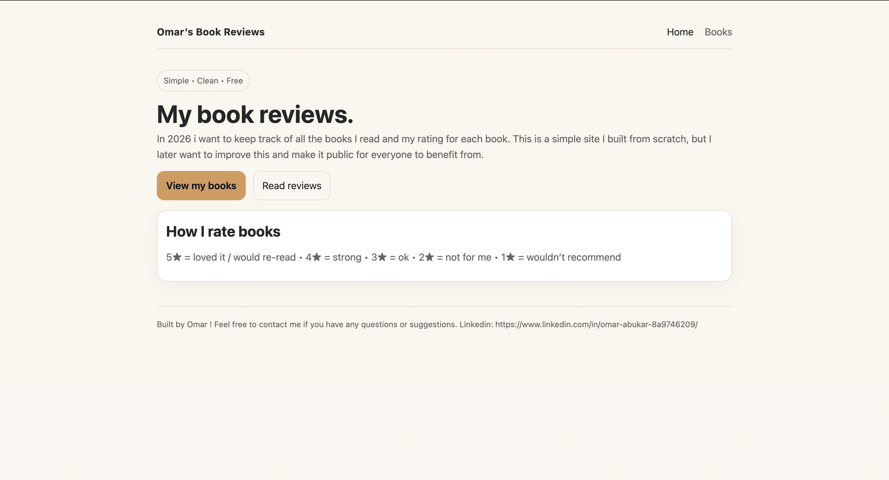
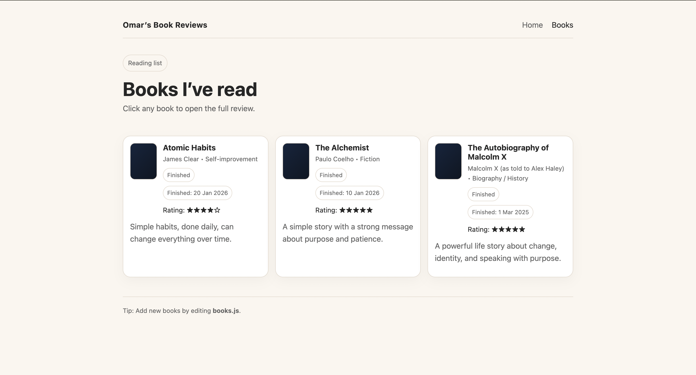
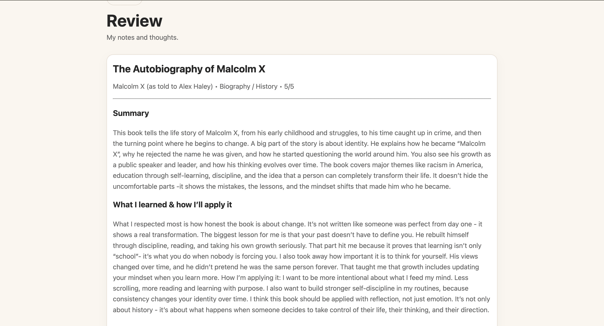

# Book Reviews Website

A personal book review website built as a long-term system for reflection and accountability.

The purpose is not volume, but depth.  
Each book is reviewed to ensure I understand the ideas, think critically about them, and apply them in real life.

---

## Preview

  

  

  

---

## Purpose of the project

This website exists to make reading more intentional.

For every book I read, I:
- write a short summary
- reflect on what I learned
- document how I plan to apply it

Over time, this becomes a growing knowledge base that reflects how my thinking develops.

---

## Why this project matters

This project represents how I approach growth and engineering.

It demonstrates:
- consistency over time
- clear written communication
- structured thinking
- ownership of a system from build to deployment

Although the subject is books, the mindset is the same one used in engineering:
build something useful, keep it simple, and improve it continuously.

---

## Technical and delivery approach

The site is intentionally minimal, but built and deployed with care.

- Static website built with **HTML, CSS, and JavaScript**
- Version controlled using **Git and GitHub**
- Automated **CI/CD with GitHub Actions**
  - every push to `main` triggers a deployment
- Hosted using **GitHub Pages**

The focus is on reliability, automation, and maintainability rather than unnecessary complexity.

---

## Current functionality

- Structured list of books with reading status
- Individual review pages
- Clear review format:
  - Summary
  - Reflection
  - Application
- Clean, distraction-free layout
- Continuous deployment pipeline

---

## Direction and future work

Planned improvements include:
- Better organisation and filtering
- Reading analytics
- AWS deployment using S3, CloudFront, and Terraform
- Further automation where it adds value

---

## Closing note

This website is a personal system, not a demo.

It reflects how I learn, how I stay disciplined, and how I think about building and maintaining things properly over time.
